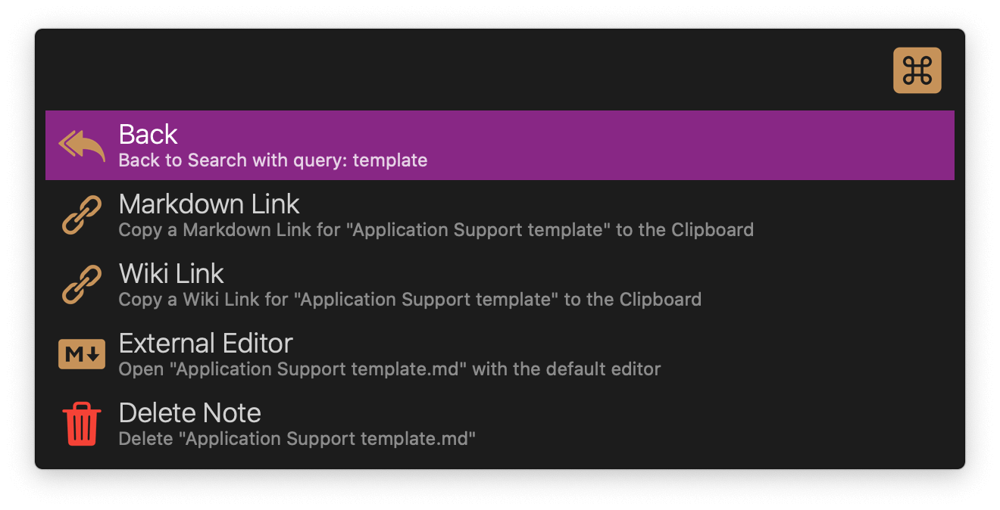
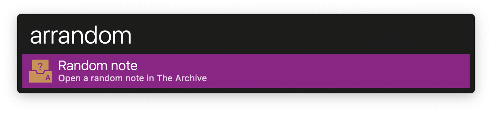
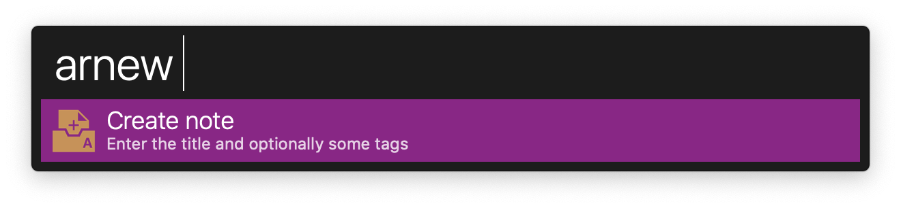
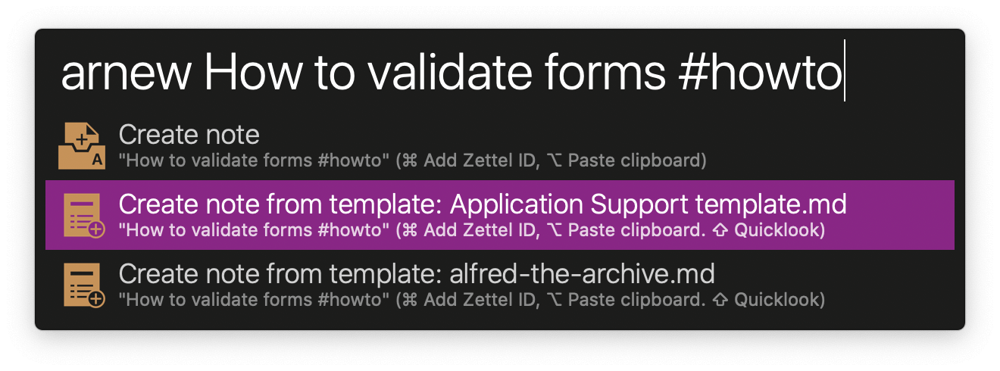
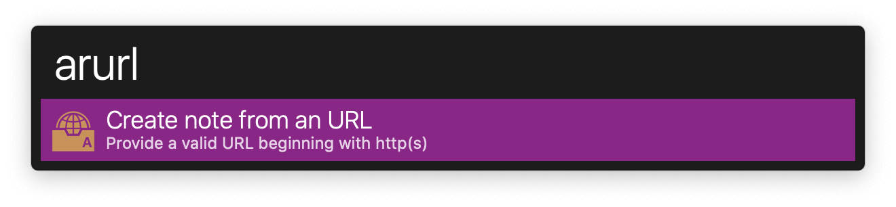
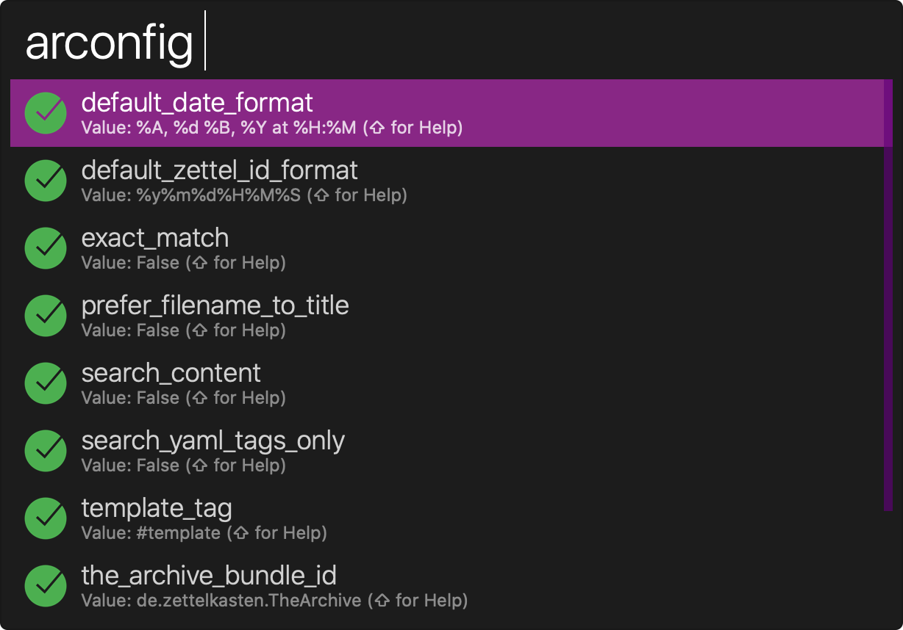

# Alfred Workflow for The Archive

This is an comprehensive workflow for The Archive that helps you work with your notes more efficiently.

## Table of Contents

- [Installation](#installation)
- [Searching Notes](#searching-notes)
- [Searching Tasks](#searching-tasks)
- [Searching Tags](#searching-tags)
- [Random Notes](#random-notes)
- [Creating Notes](#creating-notes)
- [Templates](#templates)
- [Importing URLs](#importing-urls)
- [Importing Images](#importing-images)
- [Configuration](#configuration)
- [Credits](credits)

## Installation

1. Download [the latest release](https://github.com/pryley/alfred-the-archive/releases/latest)
2. Double-click the downloaded workflow to install in Alfred.
3. Install [QLMarkdownGFM](https://github.com/Watson1978/QLMarkdownGFM) (optional)
4. Install [pandoc](#importing-urls) (optional)

## Searching Notes

To search your notes, type `ar` along with a space, then enter your search query. 


>  **Tip:** You may change the `exact_match` and `search_contents` options  to configure how the workflow searches The Archive.

### Modifier keys

There are three modifier keys that you can use with the search results:

1. **⇧ Shift:** Pressing this key will use Quicklook to preview the selected note.

   >  **Note:** To view markdown files with Quicklook, you may need to install a Quicklook extension. You can do this with [Homebrew](https://brew.sh/).
   >
   > ```bash
   > brew cask install https://raw.githubusercontent.com/Watson1978/QLMarkdownGFM/master/qlmarkdown-gfm.rb
   > ```

2. **⌥ Option:** Holding this key down as you press Enter will paste a wiki link of the selected note into the frontmost application (i.e. `[[title of the selected note]]`).

3. **⌘ Command:** Holding this key down as you press Enter will display the following "Actions" menu:

   

## Searching Tasks

Tasks are Github-flavoured checkboxes:

```markdown
- [x] This is a completed task
- [ ] This is an uncompleted task
```

To search for tasks in your notes, type `artask` along with a space, then enter your search query. Pressing Enter on a task will toggle its status (checked/unchecked).


### Modifier keys

There are two modifier keys that you can use with tasks:

1. **⌥ Option:** Holding this key down as you press Enter will open the note containing the task in the default editor.

2. **⌘ Command:** Holding this key down as you press Enter will open the noted containing the task in "The Archive".

## Searching Tags

To search the tags in your notes, type `artag` along with a space, then enter your search query. Pressing Enter on a tag will match all notes that contain the tag in "The Archive".


> **Note:** Due to a limitation of the external link URL scheme that "The Archive" uses, it is not possible to pass the `#` symbol along with the tag name to "The Archive".

### Modifier keys

There is one modifier key that you can use with tags:

1. **⌘ Command:** Holding this key down as you press Enter will paste the selected tag into the frontmost application.

## Random Notes

To display a random note in "The Archive", type `arrandom` and press Enter.



## Creating Notes

To create a note, type `arnew` along with a space, then enter the title of the note and optionally some tags. If you use a template, the title you enter will fill the {title} placeholder, and any tags you enter will fill the {tags} placeholder.



### Modifier keys

There are two modifier keys (and one modifier key combo) that you can use when creating a note without a template:

1. **⌥ Option:** Holding this key down as you press Enter will paste the current clipboard contents into the note below the title and tags.

2. **⌘ Command:** Holding this key down as you press Enter will either remove or add the Zettel ID to the note depending on whether or not you have enabled the "Use ID for empty file names" option in the preferences of the "The Archive" application.

3. **⌘ Command + ⌥ Option:** Holding these two keys down as you press Enter will both paste the current clipboard contents into the template's `{content}` placeholder, and remove or add the Zettel ID to the note depending on whether or not you have enabled the "Use ID for empty file names" option in the preferences of the "The Archive" application.

## Templates

To use a template, create a note in "The Archive" and tag the beginning of the note with `#template` (you can change the tag used for templates in the [workflow config](#configuration)).

> **Note:** The template tag must be used within the first 10 lines of the note else it will not be recognised as a template.

You may use the following placeholders in your templates:

- `{title}` This is the title of your note
- `{zettel_id}` This is the Zettel ID of the note (if used)
- `{tags}` These are the tags (if provided)
- `{date}` This is the formatted date (change the default date format in the config) 
- `{content}` This is the contents of the clipboard (if you have selected to paste it)

Here is an example Template:

```markdown
---
Title: [[{zettel_id}]] {title}
Index: [[200615130000]] Application support
Keywords: #support {tags} #template
---

{content}
```

> **Tip:** You may change the `use_zettel_id_in_title` option  to configure whether or not the `{title}` placeholder contains the Zettel ID. To change the datetime format used in the `{date}` placeholder, change the `default_date_format` option.

### Modifier keys

There are three modifier keys (and one modifier key combo) that you can use with the search results:

1. **⇧ Shift:** Pressing this key will use Quicklook to preview the selected template.

   >  **Note:** To view markdown files with Quicklook, you may need to install a Quicklook extension. You can do this with [Homebrew](https://brew.sh/).
   >
   > ```bash
   > brew cask install https://raw.githubusercontent.com/Watson1978/QLMarkdownGFM/master/qlmarkdown-gfm.rb
   > ```

2. **⌥ Option:** Holding this key down as you press Enter will paste the current clipboard contents into the template's `{content}` placeholder.

3. **⌘ Command:** Holding this key down as you press Enter will either remove or add the Zettel ID to the note depending on whether or not you have enabled the "Use ID for empty file names" option in the preferences of the "The Archive" application.
4. **⌘ Command + ⌥ Option:** Holding these two keys down as you press Enter will both paste the current clipboard contents into the template's `{content}` placeholder, and remove or add the Zettel ID to the note depending on whether or not you have enabled the "Use ID for empty file names" option in the preferences of the "The Archive" application.



## Importing URLs

To import the page content of a webpage into a note, type `arurl` along with a space and enter a valid URL beginning with `http(s)`.



> **Note:** This action requires that you have [pandoc](https://pandoc.org/) installed on your mac. Pandoc is a universal document converter and is what is used to convert the HTML of the webpage to Github-flavoured markdown. If you do not have pandoc installed, then only the URL will be copied into the note.
>
> You can install pandoc with [Homebrew](https://brew.sh/): 
>
> ```bash
> brew install pandoc
> ```

## Importing Images

The workflow provides an **Add image to The Archive** File Action which allows you to import a JPG or PNG image into the Resources Subfolder of your notes directory.


To use the File Action:

1. First you need to set your prefered "Selection Hotkey" for Actions. You can find this option on the `Features > Actions > General` tab in the Alfred Preferences.
2. Select the image in Finder and press the "Selection Hotkey" that you set in Alfred Preferences.
3. Type `add` and select the "Add image to The Archive" file action.
4. Paste the generated markdown link of the image into your note. 

## Configuration

To change the configuration of the workflow, type `arconfig` in Alfred. You can also view the help file for each highlighted option with Quicklook by pressing the **⇧ Shift** key.



>  **Note:** To view markdown files with Quicklook, you may need to install a Quicklook extension. You can do this with [Homebrew](https://brew.sh/).
>
> ```bash
> brew cask install https://raw.githubusercontent.com/Watson1978/QLMarkdownGFM/master/qlmarkdown-gfm.rb
> ```

### Default Date Format (`default_date_format`)

>  Default value:  `%d.%m.%Y %H.%M`

This option defines the datetime format used for the `{date}` placeholder in your templates. 

Please refer to the [Python strftime reference](https://strftime.org/) for the available datetime variables.

### Default Zettel ID Format (`default_zettel_id_format`)

> Default value: `%Y%m%d%H%M`

This option defines the datetime format used for the generated Zettel ID and the `{zettel_id}` placeholder in your templates.

Please refer to the [Python strftime reference](https://strftime.org/) for the available datetime variables.

### Exact Match (`exact_match`)

> Default value: `False`

This option defines if the search should match the exact search term (`True`) or the string (`False`). When the value is set to `True` it is possible to enhance the search term with wildcards. 

When set to `True`, searching for `Books` will match `Books` but not `Bookstore`. However, `Books*` will match both `Books` and `Bookstore`. 

When set to `False`, searching for `Books` will match `Books` as well as `Bookstore`.

### Prefer Filename to Title (`prefer_filename_to_title`)

> Default value: `False`

This option define what is value used when matching a search result in "The Archive" (i.e. `thearchive://match/{value}`).

When set to `True`, the note filename will be used.

When set to `False`, the note title (in the form of  `# Note Title`) will be used (if one exists) instead of the filename.

### Search Content (`search_content`)

> Default value: `False`

When set to `True`, both the filenames and note contents will be searched.

When set to `False`, only the filenames will be searched. 

### Search YAML Tags Only (`search_yaml_tags_only`)

> Default value: `False`

When set to `True`, tags will only be searched for in the YAML front matter.

When set to `False`, tags will be searched for in the entire note. 

### Template Tag (`template_tag`)

> Default value: `#template`

The template tag defines which notes are used as templates. Add the template tag in the first 5 lines of a note and it will be recognized as an available template when you create a note.

### The Archive Bundle ID (`the_archive_bundle_id`)

> Default value: `de.zettelkasten.TheArchive`

A bundle ID (or bundle identifier) uniquely identifies an application in Apple's ecosystem. This means that no two applications can have the same bundle identifier. 

This workflow uses the bundle identifier together with `the_archive_team_id` to get the saved preferences of "The Archive".

This value should never need changing.

### The Archive Team ID (`the_archive_team_id`)

> Default value: `FRMDA3XRGC`

A team ID (or team identifier) is generated by Apple and uniquely identifies the developer of an application in Apple's ecosystem.

This workflow uses the team identifier together with `the_archive_bundle_id` to get the saved preferences of "The Archive".

This value should never need changing.

### Use Zettel ID in Title (`use_zettel_id_in_title`)

> Default value: `False`

When set to `True`, the Zettel ID will be included in the `{title}` placeholder of your templates. 

When set to `False`, the Zettel ID will not be included in the `{title}` placeholder of your templates.

## Credits

This workflow was created by [Paul Ryley](https://github.com/pryley/). Special thanks to [Acidham](https://github.com/Acidham) author of [Alfred Markdown Notes](https://github.com/Acidham/alfred-markdown-notes) which this workflow was greatly inspired from.


## License

The MIT License (MIT).
